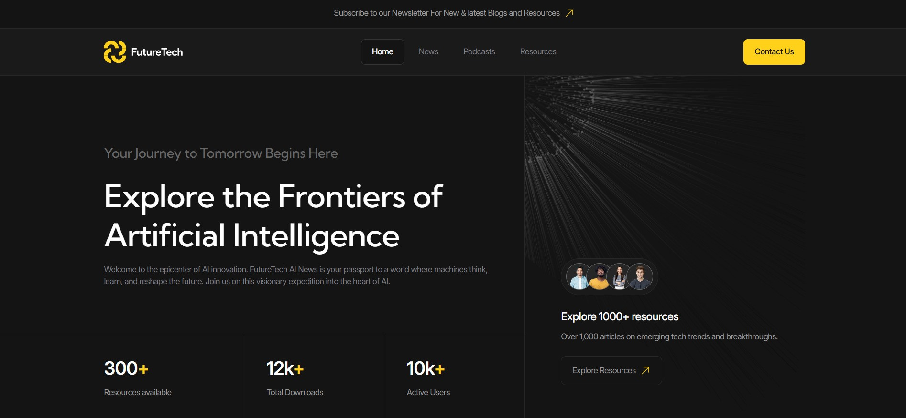

# Future Tech — Modern Landing Page for Future Technologies

A modern, responsive landing page showcasing future technologies with interactive components and accessible design.

## ✨ Features

- **Modern Tech Stack**: Built with semantic HTML5, SCSS, and vanilla JavaScript (ES6+)
- **Fully Responsive**: Optimized for all devices from mobile to desktop
- **Interactive Components**: Custom tabs system, video player, accordion, and more
- **Accessibility First**: WCAG-compliant with proper ARIA attributes and keyboard navigation
- **Performance Optimized**: Fast loading times and smooth animations
- **Cross-Browser Compatible**: Tested across modern browsers

## 🛠 Tech Stack
| Technology | Purpose | Features |
|------------|---------|----------|
| **HTML5** | Semantic markup & structure | Semantic tags, Accessibility attributes, SEO optimization |
| **SCSS/CSS3** | Styling & responsive design | Variables, Mixins, BEM methodology, Flexbox/Grid layouts |
| **Vanilla JavaScript (ES6+)** | Interactivity & functionality | ES6 classes, Modules, DOM manipulation, Event handling |
| **Figma** | Design & prototyping | Vector graphics, Components, Auto-layout, Prototyping |

## 🌐 Browser Support
| Browser | Version | Compatibility |
|---------|---------|---------------|
| **Chrome** | 60+ | ✅ Full support |
| **Firefox** | 55+ | ✅ Full support |
| **Safari** | 12+ | ✅ Full support |
| **Edge** | 79+ | ✅ Full support |
| **Opera** | 50+ | ✅ Full support |

## 🎯 Key Components

| Component | Technology | Features |
|-----------|------------|----------|
| **Tab System** | JavaScript ES6+ | Keyboard navigation, ARIA attributes, Responsive design |
| **Video Player** | HTML5 Video API | Custom controls, Fullscreen support, Progress tracking |
| **Accordion** | CSS Transitions + JS | Smooth animations, Accessibility, Multiple sections |
| **Form Validation** | JavaScript Validation | Real-time feedback, Custom error messages, Accessibility |
| **Navigation Menu** | CSS Grid + JavaScript | Mobile hamburger menu, Smooth scrolling, Active states |

## 📁 Project Structure
    future-tech-layout/
      ├── css/               # Compiled CSS files
      ├── fonts/             # Web fonts and typography
      ├── images/            # Optimized images and graphics
      ├── scripts/           # JavaScript modules
        ├── components/      # Reusable UI components
        ├── main.js          # Main application logic
      ├── styles/            # Source SCSS files
        ├── base/            # Variables, mixins, reset
        ├── components/      # Component-specific styles
        ├── layout/          # Layout and grid systems
        └── main.scss        # Main stylesheet
      ├── videos/            # Video assets
      ├── index.html         # Homepage
      ├── news.html          # News section
      ├── podcasts.html      # Podcasts page
      ├── resources.html     # Resources library
      ├── blog.html          # Blog articles
      ├── contacts.html      # Contact information
      └── README.md          # Project documentation

## 🏗 Architecture

### JavaScript Components Architecture

| Principle | Implementation | Benefits |
|-----------|----------------|----------|
| **Component-Based** | ES6 classes with inheritance from BaseComponent | Reusable, modular, maintainable code structure |
| **Event-Driven** | Custom events and delegated event handling | Clean separation of concerns, better performance |
| **State Management** | Proxy-based state with automatic UI updates | Reactive data flow, consistent state synchronization |
| **Accessibility** | ARIA attributes and keyboard navigation handlers | WCAG compliance, screen reader support |

### CSS Methodology

| Methodology | Implementation | Advantages |
|-------------|----------------|------------|
| **BEM Naming** | Block__Element--Modifier convention | Scalable, predictable CSS class names |
| **SCSS Architecture** | Modular partials with variables and mixins | Maintainable, DRY principles, easy theming |
| **CSS Custom Properties** | CSS variables for theming and consistency | Dynamic theming, easier maintenance |

## 🔗 Links

| Resource | Link | Description |
|----------|------|-------------|
| **🌐 Live Demo** | [https://dgrachkov03.github.io/future-tech-layout/](https://dgrachkov03.github.io/future-tech-layout/) | View the deployed project on GitHub Pages |
| **🎨 Figma Design** | [https://www.figma.com/design/YzTDRV7OaSoeCUBNYaoCZV/FutureTech](https://www.figma.com/design/YzTDRV7OaSoeCUBNYaoCZV/FutureTech) | Explore the complete design prototype |
| **💻 GitHub Repository** | [https://github.com/dgrachkov03/future-tech-layout](https://github.com/dgrachkov03/future-tech-layout) | Access the source code and contribute |
| **📧 Contact** | [dgrachkov03@mail.ru](mailto:dgrachkov03@mail.ru) | Get in touch for questions or collaboration |