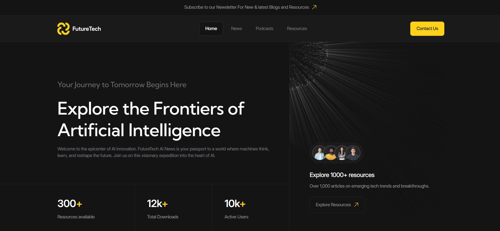

# Future Tech — современный лендинг технологий будущего

[](https://dgrachkov03.github.io/future-tech-layout/)
[](https://www.figma.com/design/YzTDRV7OaSoeCUBNYaoCZV/FutureTech?node-id=18-214&p=f&t=ilDhwuL4Wzsc03bp-0)

Лендинговая страница, посвященная технологиям будущего, с современным дизайном и интерактивными элементами.

 <!-- Можно добавить скриншот и залить в репозиторий -->

## 🛠 Технологии
- **HTML5** — семантическая верстка
- **CSS3/SCSS** — стилизация с использованием препроцессора
- **JavaScript** — интерактивность реализована на чистом JS и классах (ES6).
- **Адаптивный дизайн** — корректное отображение на всех устройствах
- **Figma** — дизайн макет

## 🚀 Быстрый старт
1. **Клонировать репозиторий**:
   
   ```bash
   git clone https://github.com/dgrachkov03/future-tech-layout.git

2. **Открыть в браузере**:
   - Просто откройте index.html в любом браузере
   - Или воспользуйтесь плагином Live Server в VS Code

## 🎨 Особенности реализации
- Использование SCSS для удобного написания стилей

- Интерактивные элементы (табы, видеоплеер, аккордеон)

- Полностью адаптивный дизайн под мобильные устройства

- Доступность: правильные ARIA-атрибуты, семантические теги

- Кроссбраузерность: поддержка современных браузеров

## 📂 Структура проекта
    future-tech-layout/
      ├── css/               # Скомпилированные CSS файлы
      ├── fonts/             # Все Шрифты
      ├── images/            # Все изображения
      ├── scripts/           # JavaScript файлы
      ├── styles/            # Исходные SCSS файлы
      ├── videos/            # Все видео
      ├── index.html         # Главная страница
      ├── news.html          # Страница новостей
      ├── podcasts.html      # Страница подкастов
      ├── resources.html     # Страница возможностей
      ├── blog.html          # Блог
      ├── contacts.html      # Контакты
      └── README.md          # Этот файл

## 🔗 Ссылки
[Демо на GitHub Pages](https://dgrachkov03.github.io/future-tech-layout/)

[Дизайн в Figma](https://www.figma.com/design/YzTDRV7OaSoeCUBNYaoCZV/FutureTech?node-id=18-214&p=f&t=ilDhwuL4Wzsc03bp-0)
